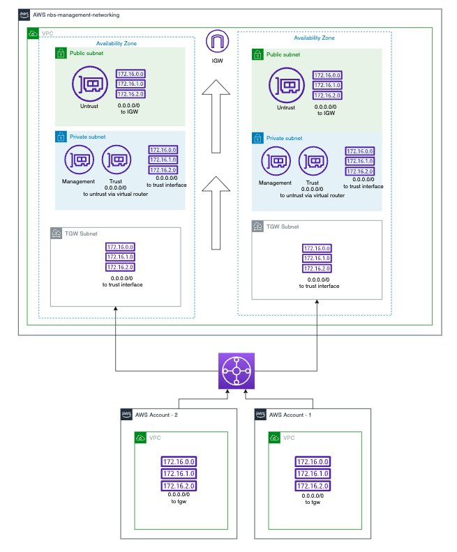

# Week1Challenge

What was the challenge?

To break down a project into smaller user stories from the point of the user, admin and staff member.
The example project was a cinema booking system with different features.

How I expected the challenge to go.

I expected it to be relatively easy as I understood the format of user stories.

What went well?

I learned how to better organise my user stories and break them down into smaller chunks.

What didn't go as planned?

I underestimated the difficulty of organising the user story into simple sections.

Possible improvements for future challenges.

Look at more examples at the start to see how the challenge is commonly structured to get a better understanding for what is required.
